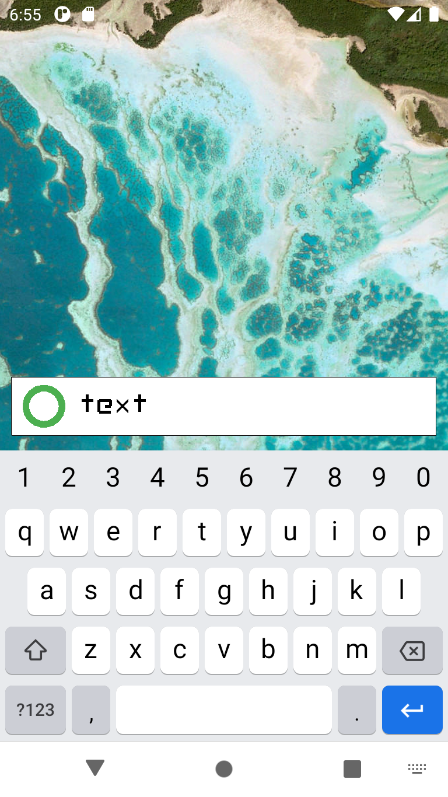

# KISS but in C
[KISS](https://github.com/Neamar/KISS) but in C (and just a text box)!

Using [rawdrawandroid](https://github.com/cnlohr/rawdrawandroid).

## Screenshot



## Install from source
Starting from no folder at all:
```
	# git clone --recurse-submodules https://github.com/EmmanuelMess/KISS-C
	# make keystore
```

You can build the app:

```
	# make clean all push run
```
